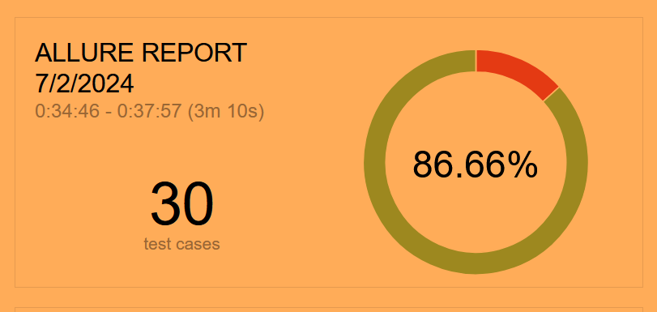

# Отчёт
Проведена автоматизация тестирования веб-сервиса, который предлагает купить тур по определённой цене

## Количество тест-кейсов
Были автоматизированы 30 тест-кейсов

## Процент успешных и не успешных тест-кейсов
* **Успешные:** 26 тест-кейсов (86.6%).
* **Не успешные:** 4 тест-кейса (13.4%).

## Общие рекомендации
Необходимо написать и добавить требования для валидации полей.  
Также необходимо починить существующие баги и довести процент успешных тестов до 100

#### Задокументированные дефекты
В процессе тестирования было задокументировано 4 issue:
https://github.com/Vaderiana/final/issues/
